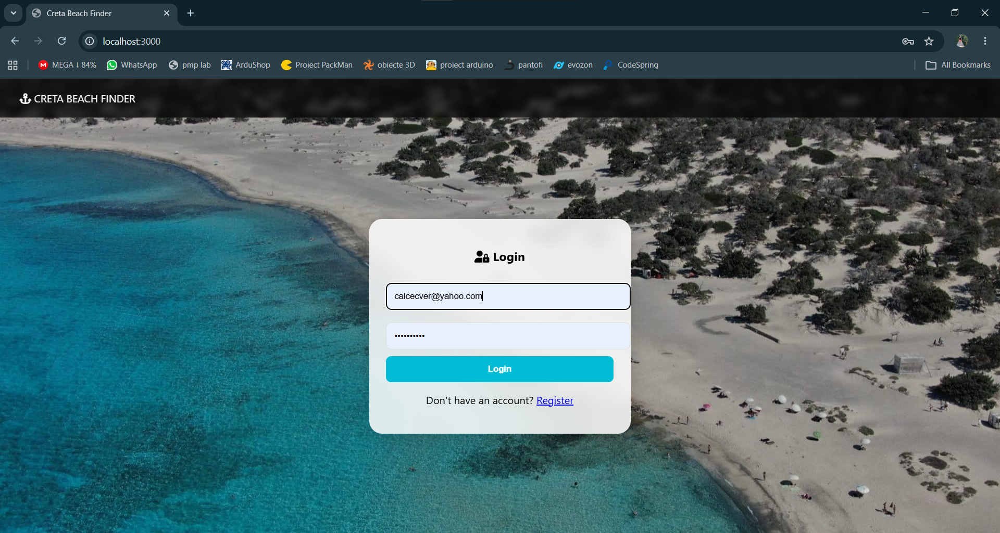
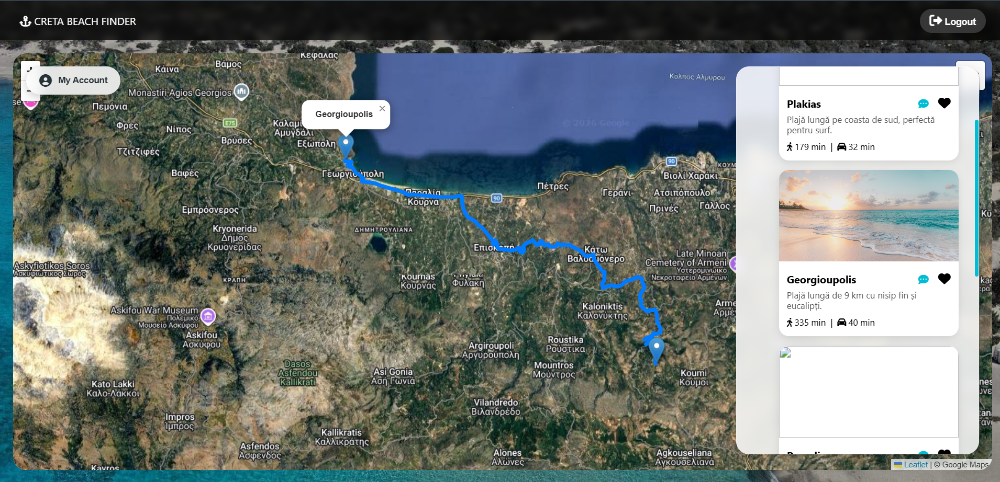
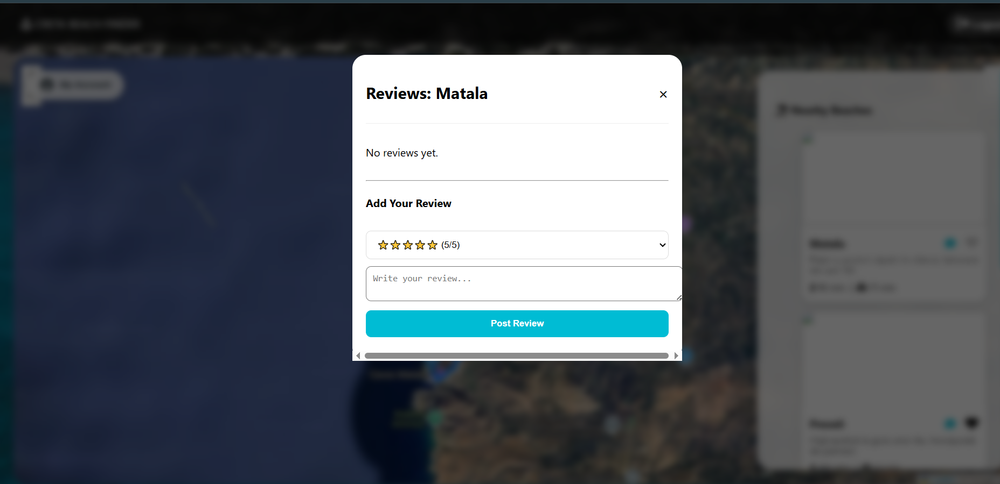

# 🏖️ Creta Beach Finder

A full-stack web application for exploring beaches in Crete. Built with Node.js, Express, SQLite, and vanilla JavaScript — no frontend framework, no shortcuts.

Users can discover beaches near any point on the map, get real walking and driving directions, save favorites, leave reviews, and manage content through a role-protected admin panel.

---

## 📸 Screenshots

### Login Page

*Clean login screen with a Cretan beach backdrop. Supports registration with instant account creation.*

---

### Interactive Map & Route Planning

*Click anywhere on the satellite map to find the 5 nearest beaches. Each card shows walking and driving time via real OpenRouteService routing. Click a card to draw the full route on the map.*

---

### Beach Reviews

*Per-beach review modal with star rating selector and comment form. Reviews are stored in SQLite and displayed with username and date.*

---

## 🧠 Overview

The goal of this project was to build a complete, production-like tourism platform from scratch — a real REST API, real database, real third-party integrations, and real authentication — without relying on any frontend framework or ORM.

Every feature was implemented manually: routing, session handling, role-based access, map interaction, and external API calls.

---

## ⚙️ Features

### User-Facing
- **Interactive Satellite Map** — Leaflet.js with Google satellite tiles and OpenStreetMap fallback
- **Click-to-Search** — click anywhere on the map to instantly find the 5 closest beaches
- **Real Route Calculation** — walking and driving times via OpenRouteService API, with route drawn on map
- **Favorites System** — toggle heart icon to save/unsave beaches; view them from your profile
- **Reviews & Star Ratings** — 1–5 star rating with written comment, displayed per beach
- **User Authentication** — register and log in; session stored in `sessionStorage` with JWT
- **Geolocation** — blue dot marks your current position on the map (if permitted)

### Admin Panel
- View all registered users with their roles
- Delete non-admin users
- Add new beaches (name, coordinates, image URL, description)
- Delete existing beaches
- Role-based visibility: the admin button only appears for admin accounts

---

## 🛠️ Tech Stack

| Layer | Technology |
|---|---|
| Frontend | HTML, CSS, Vanilla JavaScript |
| Backend | Node.js, Express.js |
| Database | SQLite (via `sqlite3`) |
| Authentication | JWT (`jsonwebtoken`) + `bcryptjs` |
| Maps | Leaflet.js + Google Satellite tiles |
| Routing | OpenRouteService API |
| Distance | Haversine formula (custom implementation) |

---

## 🚀 Getting Started

### Prerequisites

```bash
node --version   # Node.js required
npm --version
```

### Installation

```bash
git clone https://github.com/oanabye/tourism-platform-crete-island.git
cd tourism-platform-crete-island/src/backend
npm install
node app.js
```

Then open `http://localhost:3000` in your browser.

To seed the database with 15 real Cretan beaches:

```bash
node seed.js
```

---

## 📁 Project Structure

```
tourism-platform-crete-island/
├── src/
│   ├── backend/
│   │   ├── app.js          # Express server & all API routes
│   │   ├── seed.js         # Database seeder (15 beaches)
│   │   ├── db.sqlite        # SQLite database
│   │   └── package.json
│   └── frontend/
│       ├── index.html      # App structure & modals
│       ├── main.js         # All client-side logic (~400 lines)
│       └── style.css       # Styling
├── screenshots/
│   ├── login.png
│   ├── route.png
│   └── review.png
├── .gitignore
├── LICENSE
└── README.md
```

---

## 🔌 API Endpoints

| Method | Route | Description |
|---|---|---|
| POST | `/register` | Create new user account |
| POST | `/login` | Authenticate and receive JWT |
| GET | `/profile` | Get current user info |
| POST | `/closest-beaches` | Find 5 nearest beaches to a coordinate |
| POST | `/toggle-favorite` | Add or remove a beach from favorites |
| GET | `/favorites/:userId` | Get all favorites for a user |
| POST | `/add-review` | Submit a beach review |
| GET | `/reviews/:beachId` | Get all reviews for a beach |
| GET | `/admin/users` | List all users (admin) |
| DELETE | `/admin/users/:id` | Delete a user (admin) |
| GET | `/admin/beaches` | List all beaches (admin) |
| POST | `/admin/add-beach` | Add a new beach (admin) |
| DELETE | `/admin/beaches/:id` | Delete a beach (admin) |

---

## 💡 What I Learned

- Designing and structuring a REST API from scratch, including error handling and status codes
- Implementing JWT-based authentication without a library doing the heavy lifting
- Integrating third-party APIs (Leaflet, OpenRouteService) into a cohesive user experience
- Managing async operations cleanly in vanilla JS with `async/await`
- Building role-based access control and conditional UI rendering
- Working with SQLite directly — schema design, constraints, joins

---

## 🎓 Context

| | |
|---|---|
| **Type** | Personal / CV Project |
| **Year** | 3rd year, Bachelor's degree |
| **Stack** | Full-stack, no frameworks |
| **Purpose** | Practice REST API design, authentication, maps, admin panels |

---

## 👩‍💻 Author

**Oana** — [github.com/oanabye](https://github.com/oanabye)
